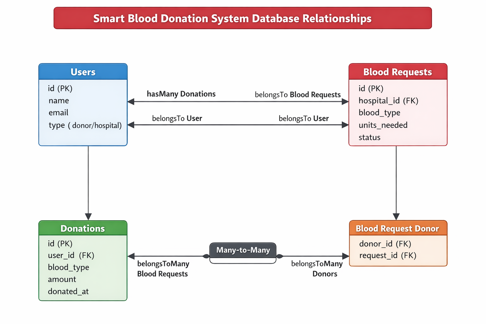

# 🔹 Database Relationships in Laravel (Comprehensive Guide)

In Laravel, **database relationships** define how tables are connected, enabling you to **efficiently retrieve, insert, and manage related data**. Laravel’s **Eloquent ORM** provides a clean, expressive syntax for defining and interacting with these relationships.

Relationships are essential for **real-world applications** because most data is interconnected: users have posts, donations, orders, etc. Properly defining relationships ensures **clean code, efficient queries, and scalable systems**.

---

## 1️⃣ Why Relationships Matter

1. **Real-world Data Modeling:**
   Applications rarely store data in isolation. For example:

   * A user can make multiple donations
   * A post can have many comments
   * Products can belong to multiple categories

2. **Efficient Queries:**
   Eloquent handles **SQL joins automatically**, optimizing queries and reducing repetitive code.

3. **Clean Code & Access:**
   You can access related records using **simple, intuitive methods** rather than writing raw SQL.

4. **Backbone of Large Systems:**
   Relationships allow for **analytics, dashboards, and AI integration**, as seen in systems like **Smart Blood Donation Platforms**.

---

## 2️⃣ Common Relationship Types in Laravel

### 1. One-to-One (1:1)

**Definition:** Each record in Table A relates to **exactly one record** in Table B.

**Example:**

* `User → Profile` (a user has one profile)

**Eloquent Implementation:**

```php
class User extends Model {
    public function profile() {
        return $this->hasOne(Profile::class);
    }
}

class Profile extends Model {
    public function user() {
        return $this->belongsTo(User::class);
    }
}
```

**Usage:**

```php
$user = User::find(1);
$profile = $user->profile; // Access user's profile
```

**Database Structure:**

| users | profiles |
| ----- | -------- |
| id    | id       |
| name  | user_id  |
| email | bio      |

`profiles.user_id` references `users.id`.

---

### 2. One-to-Many (1:N)

**Definition:** One record in Table A can have **multiple related records** in Table B, but each record in Table B belongs to only one Table A record.

**Example:**

* `User → Donations` (one user can have multiple donations)

**Eloquent Implementation:**

```php
class User extends Model {
    public function donations() {
        return $this->hasMany(Donation::class);
    }
}

class Donation extends Model {
    public function user() {
        return $this->belongsTo(User::class);
    }
}
```

**Usage:**

```php
$user = User::find(1);
$donations = $user->donations; // Collection of all donations by this user
```

**Database Structure:**

| users | donations  |
| ----- | ---------- |
| id    | id         |
| name  | user_id    |
| email | amount     |
|       | donated_at |

`donations.user_id` references `users.id`.

**Diagram:**

```
User 1 ──< Donations (many)
```

---

### 3. Many-to-Many (N:N)

**Definition:** Each record in Table A can relate to **multiple records** in Table B, and each record in Table B can relate to **multiple records** in Table A.

**Example:**

* `Students ↔ Courses` (a student can enroll in multiple courses, a course can have multiple students)

#### Pivot Table Concept

The **pivot table** acts as a bridge between two tables in a **many-to-many relationship**.

* Stores **foreign keys** of both related tables
* Optionally stores **additional metadata** like `enrolled_at`, `grade`, or `donated_at`

**Pivot Table Example:** `course_student`

| student_id | course_id |
| ---------- | --------- |
| 1          | 101       |
| 1          | 102       |
| 2          | 101       |

**Eloquent Implementation:**

```php
class Student extends Model {
    public function courses() {
        return $this->belongsToMany(Course::class)
                    ->withTimestamps(); // Optional: track enrollment time
    }
}

class Course extends Model {
    public function students() {
        return $this->belongsToMany(Student::class)
                    ->withTimestamps();
    }
}
```

**Usage:**

```php
$student = Student::find(1);
$courses = $student->courses; // All courses the student is enrolled in

$student->courses()->attach(103);   // Enroll student in course 103
$student->courses()->detach(102);   // Remove enrollment from course 102
$student->courses()->sync([101,103]); // Sync courses (update enrollments)
```

**Diagram:**

```
Student 1 ──┐
           ├─> Course 101
           └─> Course 102
Student 2 ──┘
```

---

## 4️⃣ Advanced Relationship Features

1. **Has Many Through**

   * Nested relationships, e.g., `Country → Users → Posts`
   * Retrieve all posts of a country via a single query

2. **Polymorphic Relationships**

   * A model can belong to **more than one type of model**
   * Example: Comments on Posts or Videos (`commentable_id` + `commentable_type`)

3. **Eager Loading**

   * Optimizes queries to avoid N+1 problem
   * Example: `User::with('donations')->get()`

4. **Pivot Table with Extra Fields**

   * Store additional info like `donation_date` or `role`
   * Example:

```php
$user->bloodRequests()->attach($requestId, ['donated_at' => now()]);
```

---

## 5️⃣ Real-World Example: Smart Blood Donation System

* **Tables:**

  * `Users` (donors, hospitals)
  * `Donations` (donation records)
  * `BloodRequests` (requests from hospitals)

* **Relationships:**

  * `User → hasMany(Donation)`
  * `Donation → belongsTo(User)`
  * `User → hasMany(BloodRequest)`
  * `User ↔ BloodRequest (many-to-many)` via pivot table `blood_request_user`

**Pivot Table Example:**

| user_id | blood_request_id | donated_at |
| ------- | ---------------- | ---------- |
| 1       | 101              | 2025-12-01 |
| 2       | 101              | 2025-12-02 |

**Benefits:**

* Fetch all donations by a user easily
* Track fulfilled blood requests
* Integrate with **AI prediction modules** for donation demand

---

### ✅ Key Takeaways

1. **One-to-One:** e.g., `User → Profile`
2. **One-to-Many:** e.g., `User → Donations`
3. **Many-to-Many:** e.g., `Student ↔ Courses` (pivot table required)
4. **Use Eager Loading** to optimize queries
5. **Always define foreign keys** properly
6. **Pivot tables** can store **extra metadata** for real-world workflows
7. Relationships are **crucial for scalable, maintainable applications**

---

### ER Diagram for Smart Blood Donation System


